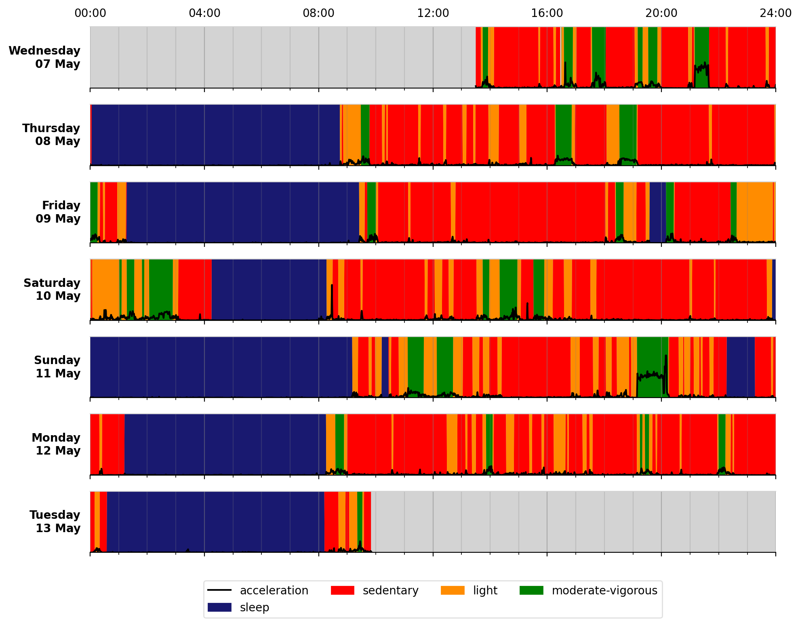

.. actinet documentation master file, created by
   sphinx-quickstart on Wed May 7 15:10:43 2025.
   You can adapt this file completely to your liking, but it should at least
   contain the root `toctree` directive.

.. actinet documentation master file

=======
ActiNet
=======

A tool to extract meaningful health information from large accelerometer
datasets. The software generates time-series and summary metrics useful for
answering key questions such as how much time is spent in sleep, sedentary
behaviour, or doing physical activity.

************
Installation
************

*Minimum requirements*: Python>=3.9, Java 8 (1.8)

The following instructions make use of Anaconda to meet the minimum requirements:

#. Download & install `Miniconda <https://docs.conda.io/en/latest/miniconda.html>`__ (light-weight version of Anaconda).
#. (Windows) Once installed, launch the **Anaconda Prompt**.
#. Create a virtual environment::

     conda create -n actinet python=3.9 openjdk pip

#. Activate the environment::

     conda activate actinet

#. Install :code:`actinet`::

     pip install actinet

The next time you want to use :code:`actinet`, just activate the environment again with:
::

    conda activate actinet

***************
Getting started
***************

To extract and visualise a summary of activity data from a single file, run the following command in the terminal

.. code-block:: 

    actinet data/sample.cwa.gz -p

The sample-outputSummary.json will look like

.. code-block::

    {
        "Filename": "data/sample.cwa.gz",
        "Filesize(MB)": 69.4,
        "WearTime(days)": 5.948125,
        "NonwearTime(days)": 0.0,
        "ReadOK": 1,
        ...
    }

And the timeSeries-plot.png will look like:

    Output plot of overall activity and class predictions for each 30-second time window

***************
Citing our work
***************
When using this tool, please consider citing the works listed in `CITATION.md <https://github.com/OxWearables/actinet/blob/master/CITATION.md>`_.

*******
Licence
*******
See `LICENSE.md <https://github.com/OxWearables/actinet/blob/master/LICENSE.md>`_.

****************
Acknowledgements
****************
We would like to thank all our code contributors, manuscript co-authors, and research participants for their help in making this work possible.
`Contributors Graph <https://github.com/OxWearables/actinet/graphs/contributors>`_.

.. toctree::
   :maxdepth: 1
   :caption: Contents:

   cliapi
   usage
   methods
   datadict

******************
Indices and tables
******************

* :ref:`genindex`
* :ref:`modindex`
* :ref:`search`

