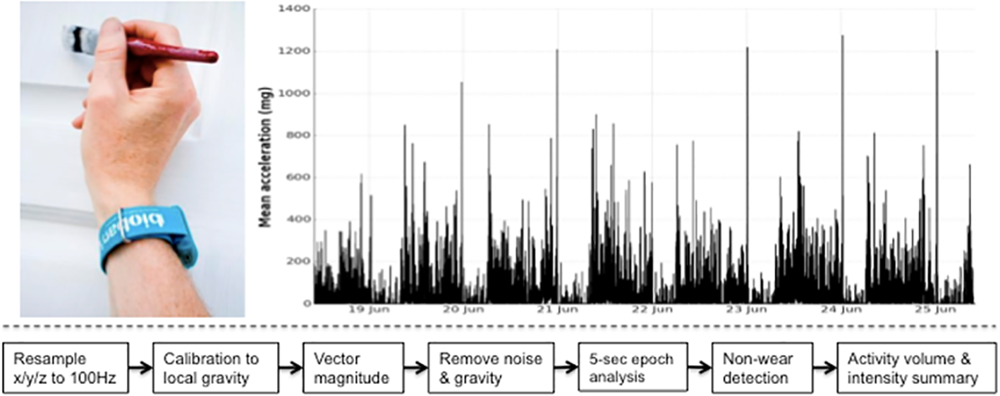
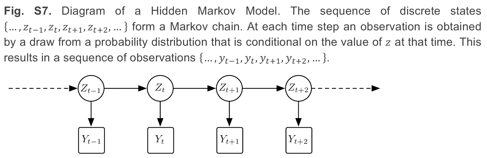
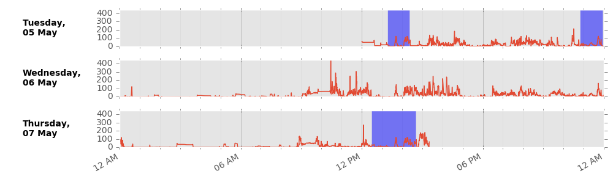
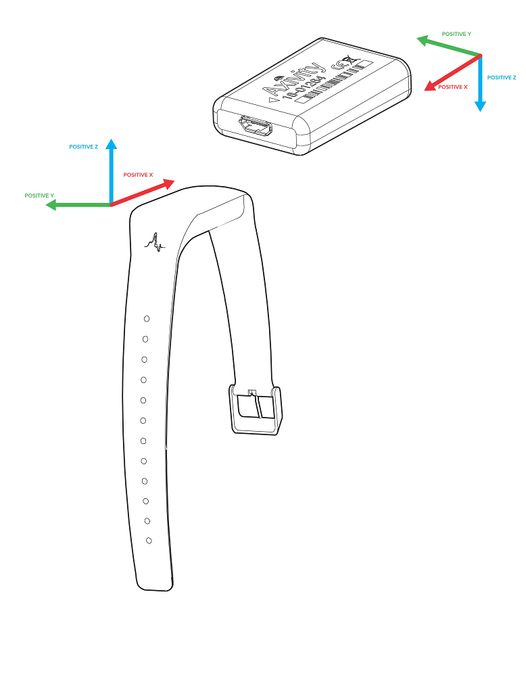
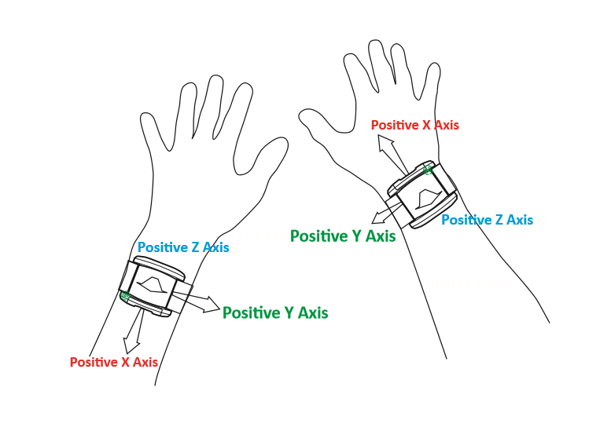

#######
Methods
#######

Interpreted levels of physical activity can vary, as many approaches can be taken to extract summary physical activity information from raw accelerometer data. 
To minimise error and bias, our tool uses published methods to calibrate, resample, and summarise the accelerometer data e.g. [Doherty2017]_ [Willetts2018]_ [Doherty2018]_ and [Walmsley2021]_.
Building on this work, deep-learning approaches to activity classification have shown improved performance over traditional machine learning methods [Chan2024]_. 
In particular, the use of a self-supervised learning shows better performance over training the neural netowrks from scratch, encouraging its use [Yuan2024]_.

Note that data processing methods are under continual development, and so data processed with different versions of the tool and of models may not be directly comparable.

    UK Biobank triaxial accelerometer and processing steps to extract physical activity information.

    Axivity AX3 triaxial accelerometer worn on dominant hand as used in UK Biobank (top left). 
    Time series trace of processed accelerometer values after one week of wear (top right). 
    Overview of process to extract proxy physical activity information from raw accelerometer data (bottom).

****************
Data preparation
****************

Calibration
===========
To ensure different devices provide a similar output under similar conditions we calibrate the acceleration signals to local gravity using a procedure initially described by [vanHees2014]_ and run in UK Biobank [Doherty2017]_.

Briefly, we identify stationary periods in ten second windows where all three axes have a standard deviation of less than 15mg, for a period of 90 minutes.
We can also optionally require that this standard deviation is above a minimum threshold, to avoid identifying artificially imputed stationary periods, such as, when idle sleep mode in the active in the ActiGraph GT3X, as stationary.
These stationary periods are then used to optimise the gain and offset for each axis (6 parameters) to fit a unit gravity sphere using ordinary least squares linear regression.

Resampling
==========
The raw accelerometer data collected from a variety of devices can have different sampling rates.
However, the modified ResNet-18 model used in this tool is trained on data sampled at 30Hz in 30-second blocks. 
Thus, valid data is resampled to 30 Hz using linear interpolation.

Non-wear detection
==================
Non-wear episodes are identified by detecting extended periods of minimal movement across all axes of the accelerometer signal.
This is determined by calculating the standard deviation of acceleration in a rolling 10-second window for each axis.
A window is considered stationary if the standard deviation on all three axes remains below a threshold of 15mg.
If such stationary behavior persists for more than 90 minutes, the corresponding period is classified as a non-wear episode.
All accelerometer data within these non-wear periods is excluded, and classifications for these times must be imputed from other days.

Low-pass filtering
==================
Machine noise is removed using a eigth order Butterworth low pass filter with a cutoff frequency of 20Hz. 
This filter is applied independently to all three axes of acceleration. 

Segmentation
============
To classify accelerometer data by activity intensity, the data is segmented into non-overlapping 30-second epochs.
Each segment is expected to contain 900 rows of data, corresponding to 30Hz sampling over 30 seconds.
During training, each segment is assigned a ground truth label based on the most frequent activity label within the segment, even if some rows of data lack an annotation label.
Segments are considered invalid and excluded if they contain any missing data, either due to NaN value, missing columns, or an insuffient number of rows (i.e., fewer than 900).
During deployment, segments are included as long as they contain at least half of the expected data points (≥ 450 rows).
In such cases, the segment is zero-padded to reach 900 rows before being passed to the model.

***************************
Activity classification
***************************

Classification
==============
For activity classification we use a two stage model consisting of a self-supervised, modified 18-layer ResNet-V2 and hidden markov models.

ResNet-18 classifier
====================
The ResNet-18 model is a convolutional neural network (CNN) that has been modified to accept 30-second segments of accelerometer data as input.
This model contain 18 layers, including 17 convolutional layers and one fully connected layer [He2016]_.
This model was pre-trained on roughly 100,000 person-days of data from the UK Biobank physical activity monitoring dataset, using self-supervised learning to determine the arrow of time from the accelerometer signal [Yuan2024]_. 
With the deep layers of the model frozen, the final fully connected layer was fine tuned to the classification task, using the Capture-24 dataset, to classify labels of activity intensity: sleep, sedentary, light and moderate-vigorous activity [Chan2024]_.

Hidden Markov models
====================
The ResNet-18 model is able to classify datapoints, but does not have an understanding of our data as having come from a time series. 
Therefore we use a hidden Markov model (HMM) to encode the temporal structure of the sequence of classes and thus obtain a more accurate sequence of predicted classes. 
The transition matrix (likelihood of moving from one activity type to another) and emission distribution (likelihood of ResNet-18 correctly classifying a given activity type) are empirically calculated. 
The transition matrix is calculated from the training set sequence of activity states. The calculation of emission probabilities comes from the output logits of the ResNet-18 model, when deployed on an unseen validation population. 

With this empirically defined HMM, we can then run the Viterbi algorithm to find the most likely sequence of states given a sequence of observed emissions from the ResNet-18. 
This smoothing corrects erroneous predictions from the initial model that lacked temporal information, such as where the error is a blip of one activity surrounded by another and the transitions between those two classes of activity are rare.

    Diagram of a Hidden Markov Model.

Sleep correction
================

To improve the accuracy and reliability of sleep classification, we apply an optional post-hoc correction step.
Firstly, we can exclude short sleep blocks, that fall below a specified duration threshold, such as 1 hour, as seen in the Biobank accelerometer analysis tool.
Additionally, we can ensure that each day has only one sleep block, which is the longest sleep block in that day.
For all blocks of sleep that do not meet these criteria, we convert them to sedentary activity.

**************************
Physical activity analysis
**************************

Data imputation
===============
After deploying the model on multiple days of data, it is possible that some days are missing data due to non-wear, or other reasons.
Given this, it is necessary to impute any missing data, to offer a fair comparison of activity levels across days between different participants, independent of total wear time.
To do so, data is imputed according to the hierarchical structure:

- Same time, same weekday:
  Missing data points are first imputed using the average activity levels at the same time of day on the same day of the week (e.g., Mondays at 3:00 PM).

- Same time, same day type (weekday/weekend):  
  If no data is available for that specific weekday, the average is taken from the same time of day across all other days of the same category (weekdays or weekends).

- Same time, all days:  
  If neither of the above is available, the imputation defaults to the overall average activity label at that time of day across all available days.

    Example imputation for non-wear (blue shaded) data.

**********************************
Summary physical activity variable
**********************************

Minimum wear time
=================
A physical activity outcome variable is generated by averaging all worn and imputed values. 
For analysis of UK Biobank accelerometer data, it may be prudent to remove individuals who had less than three days (72 hours) of data or who did not have data in each one-hour period of the 24-hour cycle.
We defined these minimum wear time guidelines by performing missing data simulations on 29,765 participants [Doherty2017]_. 
Using intraclass correlation coefficients, at least 72 hours (3 days) of wear were needed to be within 10% of the true stable seven day measure.

Time series file
================
A .csv.gz time series file is generated for each participant. 
This provides researchers with a simple way to interrogate the epoch level data for each physical activity outcome variable, without the need for expertise in processing large complex raw data files.

.. _note on the UK-Biobank dataset:

**********************************************
A note on the UK-Biobank accelerometer dataset
**********************************************

Different device versions were used during the UK-Biobank accelerometer study having slightly different specifications.
In particular, this meant that the orientation of the axes of the tri-axial accelerometers were not standardised across participants.
Further, participants could have worn the device on either wrist, which also affects axes orientation.
To address this, during training of the ResNet-18 model, data was augmented by applying random rotation and switching of the axes of the accelerometer data.

Below are axes orientations for two device versions used.

**********
References
**********
.. [Doherty2017] Doherty A, Jackson D, Hammerla N, et al. (2017). Large scale population assessment of physical activity using wrist worn accelerometers: the UK Biobank study. *PLOS ONE*, 12(2): e0169649. https://doi.org/10.1371/journal.pone.0169649

.. [Willetts2018] Willetts M, Hollowell S, Aslett L, et al. (2018). Statistical machine learning of sleep and physical activity phenotypes from sensor data in 96,220 UK Biobank participants. *Scientific Reports*, 8(1): 7961. https://doi.org/10.1038/s41598-018-26174-1

.. [Doherty2018] Doherty A, Smith-Bryne K, Ferreira T, et al. (2018). GWAS identifies 14 loci for objectively-measured physical activity and sleep duration with causal roles in cardiometabolic disease. *Nature Communications*, 9(1): 5257. https://doi.org/10.1038/s41467-018-07743-4

.. [Walmsley2021] Walmsley R, Chan S, Smith-Byrne K, et al. (2021). Reallocation of time between device-measured movement behaviours and risk of incident cardiovascular disease. *British Journal of Sports Medicine*. Published online. https://doi.org/10.1136/bjsports-2021-104050

.. [vanHees2014] van Hees VT, Fang Z, Langford J, et al. (2014). Autocalibration of accelerometer data for free-living physical activity assessment using local gravity and temperature: an evaluation on four continents. *J Appl Physiol*, 117: 738–744. https://doi.org/10.1152/japplphysiol.00421.2014

.. [He2016] He K, Zhang X, Ren S, Sun J. (2016). Identity Mappings in Deep Residual Networks. *arXiv preprint* arXiv:1603.05027. `https://doi.org/10.48550/arXiv.1603.05027 <https://arxiv.org/abs/1603.05027>`_

.. [Yuan2024] Yuan H, Chan S, Creagh AP, et al. (2024). Self-supervised learning for human activity recognition using 700,000 person-days of wearable data. *npj Digital Medicine*, 7(1): 1–10. https://doi.org/10.1038/s41746-024-01062-3

.. [Chan2024] Chan S, Yuan H, Tong C, et al. (2024). CAPTURE-24: A large dataset of wrist-worn activity tracker data collected in the wild for human activity recognition. *Scientific Data*, 11(1): 1. https://doi.org/10.1038/s41597-024-03960-3
